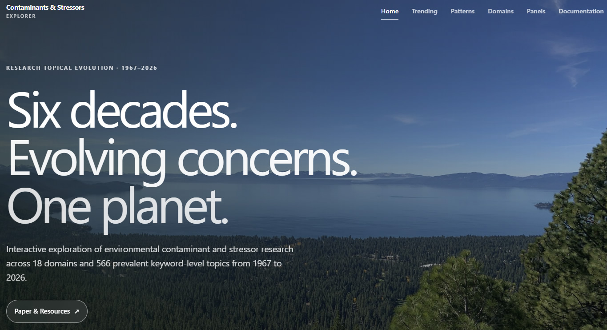

<p align="center">

# 🔍 ContamLens

### Environmental Contaminants & Stressors Explorer

**Explore the evolution of environmental contaminants/stressors across 60 years of research (1967–2026).**

<p>

<a href="https://starfriend10.github.io/ContamLens/">

</a>

<a href="#associated-publication">

</a>

<a href="#citation">

</a>

</p>

*An interactive companion platform for exploring long-term environmental research trends through expert-informed topic classification and interactive visualization.*

</p>

---

<p align="center">

<a href="https://starfriend10.github.io/ContamLens/">



</a>

</p>

<p align="center">

**👆 Click the image above to launch the interactive platform**

</p>

---

# 🚀 At a Glance

<div align="left">

| Study Period | Publications | Topics | Domains | Panels |
|:-------------:|:------------:|:------:|:-------:|:------:|
| **1967–2026** | **34,000+** | **566** | **18** | **4** |

</div>

---

# 🌟 Why ContamLens?

Unlike traditional bibliometric tools, **ContamLens** was designed specifically for environmental contaminants and stressors. It combines domain-informed text mining with expert knowledge to reveal long-term evolution, emerging concerns, and research patterns through an intuitive interactive interface.

| Traditional bibliometric analysis | ContamLens |
|----------------------------------|------------|
| Publication statistics | Environmental intelligence |
| Keyword co-occurrence | Expert-informed contaminant domains |
| Static figures | Interactive exploration |
| General trend analysis | Six decades of topic evolution |
| Separate analyses | Integrated environmental platform |

---

# 🔍 Explore the Platform

| Section | Description |
|----------|-------------|
| 📈 **Trending** | Identify emerging, increasing, declining, and legacy contaminants through temporal comparisons. |
| 🌊 **Patterns** | Explore continuous, V-shaped, Λ-shaped, wave-shaped, and other temporal trajectories. |
| 🌍 **Domains** | Browse 18 expert-informed contaminant and stressor domains. |
| 🧩 **Panels** | Compare related environmental domains through four integrated thematic panels. |
| 📊 **Temporal Dynamics** | Track long-term changes in domain-level research activity. |
| 🔄 **Classification Evolution** | Visualize how environmental research composition changes over time. |
| 📚 **Documentation** | Learn the analytical framework, temporal comparisons, and frequency metrics behind the platform. |

### 🎥 Quick Platform Guide

[](https://www.youtube.com/watch?v=5_c0isrzuXc)
---

# ✨ Platform Highlights

- 🌍 **34,000+** environmental publications
- 🏷️ **566** contaminant and stressor topics
- 🧪 **18** expert-informed environmental domains
- 📊 Four integrated thematic panels
- 📈 Consecutive 15-year temporal comparisons
- 🔄 Five-year rolling-window analyses
- 🤖 AI-assisted topic discovery with expert environmental interpretation
- 💻 Interactive Plotly visualizations
- 📱 Responsive website optimized for desktop and mobile devices

---

# 🔬 Analytical Framework

```text
    47,000+ ES&T Publications
                 │
                 ▼
34,000+ Contaminant Relevant Publications
                 │
                 ▼
     Topic Identification & Screening
                 │
                 ▼
 566 Contaminant & Stressor Topics
                 │
                 ▼
18 Expert-informed Environmental Domains
                 │
                 ▼
      Four Integrated Panels
                 │
                 ▼
 Interactive Trend & Pattern Exploration
```

---

# 🌐 Visit ContamLens

### Live Platform

**https://starfriend10.github.io/ContamLens/**

---

### Local Preview

Clone the repository:

```bash
git clone https://github.com/starfriend10/ContamLens.git
```

Open

```text
index.html
```

directly in your web browser.

Alternatively, launch a simple local server:

```bash
python -m http.server
```

and visit

```text
http://localhost:8000
```

---

# 📄 Associated Publication

The accompanying manuscript describing the methodology, expert-guided classification framework, and scientific findings will be added after publication.

---

# 📖 Citation

Citation information will be available following publication.

```bibtex
@article{ContamLens,
  title   = {To be updated},
  author  = {To be updated},
  journal = {To be updated},
  year    = {2026},
  doi     = {To be updated}
}
```

---

# 📜 License

This project is distributed under the terms of the **MIT License**.

---

<p align="center">

### ContamLens

**Seeing six decades of environmental research through topics, domains, and time.**

🌐 https://starfriend10.github.io/ContamLens/

</p>
